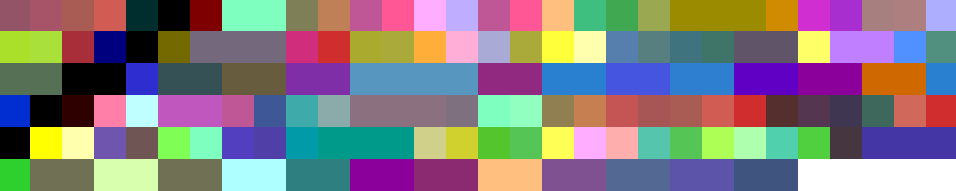
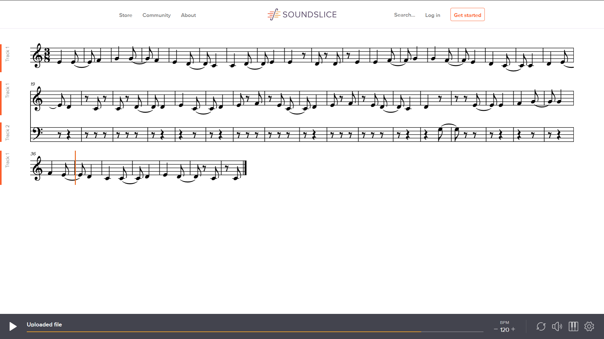

# Project Description
MusicSystem is a C++ CLI program that is capable of the following things:
1. Can load-in note data from a .CSV (key -> midiNum mapping)
2. Can load-in composition data from VirtualPiano (www.virtualpiano.net)
3. Display the composition in the console window
4. Modify the composition (duration, ticks, notes, etc.)
5. Export to .BMP
6. Export to .MusicXML
7. Export to .MIDI

The PianoPlayer project builds on top of the knowledge gained by building *MusicSystem*.

# The CLI
The user can interact with the program through the console window: 

# Program Breakdown
## Data input
The note data (contained in the file map.csv) is used to map a specific keyboard key to a Note / Octave, as well as a unique MIDI number (later used in exporting). This is how the program knows which note to play through the Java Sounds API.

The VirtualPiano data is loaded in via a regular text file. With a combination of Java Streams, and a couple of Regex expressions, the program is able to quickly create multiple maps which are used later by different classes. Each note is given a unique number indicating its position within the sequence. The sequence is sorted using this number, thus creating the final composition.
### Types of VirtualPiano symbols
1. Blank character -> Pause with a duration of 1/8
2. | -> Pause with a duration of 1/4
3. [abc] (notes within square brackets) -> Notes that should be played together (a chord), with a duration of 1/4
4. [a b c] (space in square brackets) -> Notes that should be played separately, with a duration of 1/8
5. Characters outside of brackets -> Notes that should be played with a duration of 1/4

# Exporting to .BMP
Each note / symbol in the composition is assigned a certain color value that is calculated via special functions (see the attached .pdf for more details on these). Using this data, a .bmp image is created with the given dimensions of the user - each pixel representing one note (or chord). 
Some examples include:
* Ode_to_joy.txt 

* We_Wish_You_A_Merry_Christmas.txt 

# Exporting to .MusicXML
MusicXML is a set format with strict rules. This was the easiest of the three exports, as a lot of xml code is basic boilerplate. The .MusicXML files can be opened and played using an online tool called [SoundSlice](https://www.soundslice.com/musicxml-viewer/). 

# Exporting to .MIDI
For the purpose of .midi exporting, an external library was used -> [MidiFile](https://github.com/craigsapp/midifile).